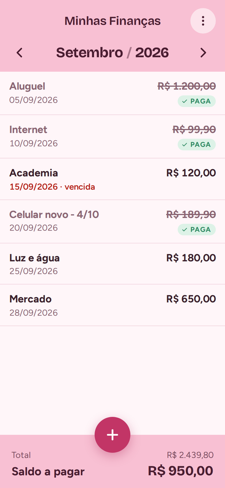
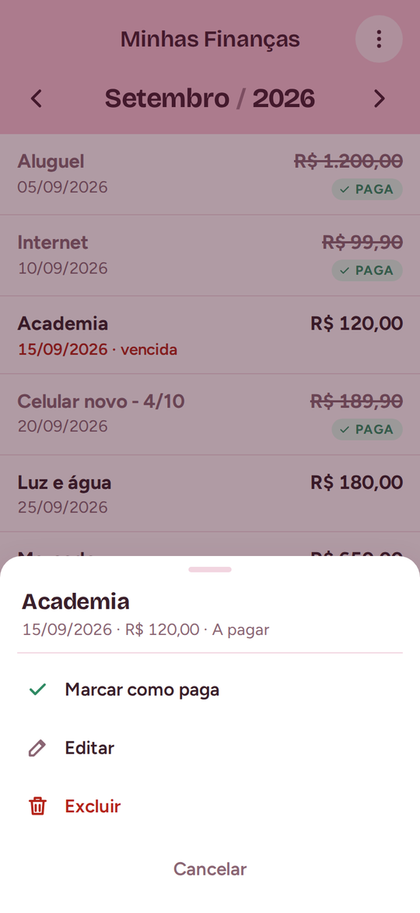
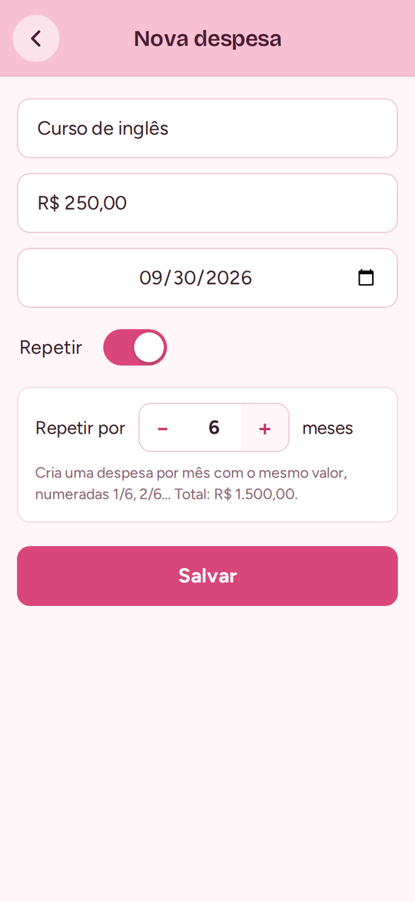
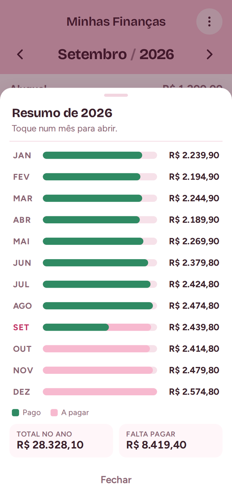

# Minhas Finanças

Fiz esse site em formato de app para organizar as finanças do mês: lançar as contas, acompanhar o que já foi pago e ver quanto ainda falta pagar. Ele abre no celular como um app de verdade, com ícone na tela inicial, e cada pessoa entra com a própria conta Google e vê só as próprias despesas.

**Acesse:** https://minhas-financas-9v4l.vercel.app

## Telas

<table>
  <tr>
    <td align="center"><br><sub>Abertura</sub></td>
    <td align="center"><br><sub>Login com Google</sub></td>
    <td align="center"><br><sub>Despesas do mês</sub></td>
  </tr>
  <tr>
    <td align="center"><br><sub>Marcar como paga, editar ou excluir</sub></td>
    <td align="center"><br><sub>Nova despesa repetida</sub></td>
    <td align="center"><br><sub>Resumo do ano</sub></td>
  </tr>
</table>

<sub>As imagens usam despesas de exemplo.</sub>

## O que dá pra fazer

- Lançar despesas com descrição, valor e data.
- Repetir uma despesa por vários meses. As parcelas ficam numeradas (1/10, 2/10…).
- Marcar como paga. O total do mês e o saldo a pagar se atualizam na hora.
- Ver contas atrasadas em vermelho, marcadas como "vencida".
- Passar de um mês para outro pelas setas ou deslizando o dedo.
- Ver o resumo do ano, com o que já foi pago e o que falta.
- Exportar tudo numa planilha (.csv).
- Usar sem internet. O que for lançado é enviado quando a conexão voltar.
- Instalar na tela inicial do celular (PWA).

## Como foi feito

- **HTML, CSS e JavaScript puro**, sem framework.
- **Firebase Authentication** para o login com Google.
- **Cloud Firestore** para salvar as despesas de cada pessoa, protegidas por regras de segurança.
- **PWA** (manifest e service worker) para instalar no celular e funcionar offline.
- Hospedado na **Vercel**.

## Estrutura

```
index.html            telas: abertura, login e app
app.js                lógica do app, login e banco de dados
styles.css            visual (tema rosa)
firebase-config.js    configuração do projeto Firebase
firestore.rules       regras de segurança do Firestore
manifest.webmanifest  dados para instalar no celular
sw.js                 service worker (abre rápido e funciona offline)
icons/                ícones e imagem da abertura
screenshots/          imagens deste README
```

## Como fazer o seu

1. Crie um projeto no [Firebase](https://console.firebase.google.com).
2. Em **Authentication → Método de login**, ative o **Google**.
3. Crie o **Firestore Database** e cole o conteúdo de `firestore.rules` na aba **Regras**.
4. Em **⚙ Configurações do projeto → Seus apps → Web**, copie o `firebaseConfig` para o `firebase-config.js`.
5. Publique na Vercel, ou em qualquer hospedagem de site estático.
6. Em **Authentication → Configurações → Domínios autorizados**, adicione o endereço do site.
